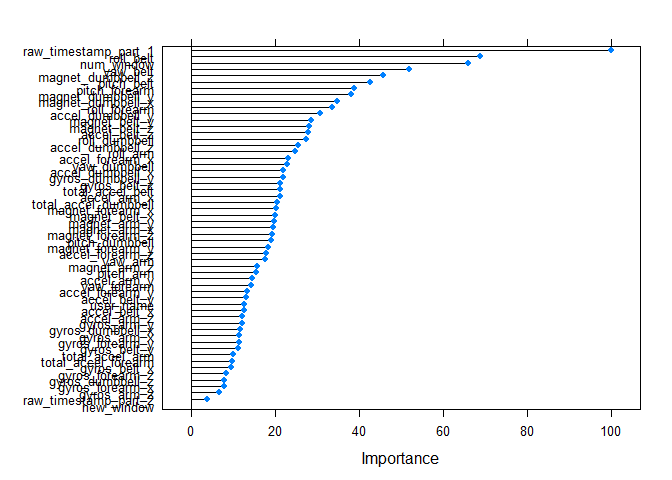

# PredictionPMLAssignment for Practicel Machine Learning
Vipul Sagare  
Saturday, June 20, 2015  


```
## Run time: 2015-06-21 00:22:48
## R version: R version 3.1.2 (2014-10-31)
```

> **Background**

> Using devices such as Jawbone Up, Nike FuelBand, and Fitbit it is now possible to collect a large amount of data about personal activity relatively inexpensively. These type of devices are part of the quantified self movement - a group of enthusiasts who take measurements about themselves regularly to improve their health, to find patterns in their behavior, or because they are tech geeks. One thing that people regularly do is quantify how much of a particular activity they do, but they rarely quantify how well they do it. In this project, your goal will be to use data from accelerometers on the belt, forearm, arm, and dumbell of 6 participants. They were asked to perform barbell lifts correctly and incorrectly in 5 different ways. More information is available from the website here: http://groupware.les.inf.puc-rio.br/har (see the section on the Weight Lifting Exercise Dataset). 


> **Data **

> The training data for this project are available here: 

> https://d396qusza40orc.cloudfront.net/predmachlearn/pml-training.csv

> The test data are available here: 

> https://d396qusza40orc.cloudfront.net/predmachlearn/pml-testing.csv

> The data for this project come from this source: http://groupware.les.inf.puc-rio.br/har. If you use the document you create for this class for any purpose please cite them as they have been very generous in allowing their data to be used for this kind of assignment. 

> **What you should submit**

> The goal of your project is to predict the manner in which they did the exercise. This is the "classe" variable in the training set. You may use any of the other variables to predict with. You should create a report describing how you built your model, how you used cross validation, what you think the expected out of sample error is, and why you made the choices you did. You will also use your prediction model to predict 20 different test cases. 

> 1. Your submission should consist of a link to a Github repo with your R markdown and compiled HTML file describing your analysis. Please constrain the text of the writeup to < 2000 words and the number of figures to be less than 5. It will make it easier for the graders if you submit a repo with a gh-pages branch so the HTML page can be viewed online (and you always want to make it easy on graders :-).
> 2. You should also apply your machine learning algorithm to the 20 test cases available in the test data above. Please submit your predictions in appropriate format to the programming assignment for automated grading. See the programming assignment for additional details. 

> **Reproducibility **

> Due to security concerns with the exchange of R code, your code will not be run during the evaluation by your classmates. Please be sure that if they download the repo, they will be able to view the compiled HTML version of your analysis. 


# Prepare the datasets

Read the training data into a data table.


```r
require(data.table)
```

```
## Loading required package: data.table
```

```
## Warning: package 'data.table' was built under R version 3.1.3
```

```r
library(Hmisc)
```

```
## Warning: package 'Hmisc' was built under R version 3.1.3
```

```
## Loading required package: grid
## Loading required package: lattice
## Loading required package: survival
## Loading required package: splines
## Loading required package: Formula
```

```
## Warning: package 'Formula' was built under R version 3.1.3
```

```
## Loading required package: ggplot2
```

```
## Warning: package 'ggplot2' was built under R version 3.1.3
```

```
## 
## Attaching package: 'Hmisc'
## 
## The following objects are masked from 'package:base':
## 
##     format.pval, round.POSIXt, trunc.POSIXt, units
```

```r
library(caret)
```

```
## Warning: package 'caret' was built under R version 3.1.3
```

```
## 
## Attaching package: 'caret'
## 
## The following object is masked _by_ '.GlobalEnv':
## 
##     best
## 
## The following object is masked from 'package:survival':
## 
##     cluster
```

```r
library(randomForest)
```

```
## Warning: package 'randomForest' was built under R version 3.1.3
```

```
## randomForest 4.6-10
## Type rfNews() to see new features/changes/bug fixes.
## 
## Attaching package: 'randomForest'
## 
## The following object is masked from 'package:Hmisc':
## 
##     combine
```

```r
library(foreach)
```

```
## Warning: package 'foreach' was built under R version 3.1.3
```

```r
library(doParallel)
```

```
## Warning: package 'doParallel' was built under R version 3.1.3
```

```
## Loading required package: iterators
```

```
## Warning: package 'iterators' was built under R version 3.1.3
```

```
## Loading required package: parallel
```

```r
set.seed(20150125)
```
Rest the testing and trainging data
and convert all blank('""'), '#DIV/0' and 'NA' values are converted to 'NA'.


```r
download.file('http://d396qusza40orc.cloudfront.net/predmachlearn/pml-training.csv', 'pml-training.csv')
download.file('http://d396qusza40orc.cloudfront.net/predmachlearn/pml-testing.csv','pml-test.csv' )
trainingSrc   <- read.csv('pml-training.csv', na.strings=c("NA","#DIV/0!", ""))
testSrc       <- read.csv('pml-test.csv' , na.strings=c("NA", "#DIV/0!", ""))
```
Leave columns having no more than 60% of NA values


```r
goodVars    <- which((colSums(!is.na(trainingSrc)) >= 0.6*nrow(trainingSrc)))
trainingSrc <- trainingSrc[,goodVars]
testSrc     <- testSrc[,goodVars]
```
minor fixes to test set are needed to perform well with random forests.

```r
# remove problem id
testSrc <- testSrc[-ncol(testSrc)]
# fix factor levels
testSrc$new_window <- factor(testSrc$new_window, levels=c("no","yes"))
trainingSrc <- trainingSrc[,-c(1,5)]
testSrc     <- testSrc[,-c(1,5)]
```

#Divide data into 60% training and 40% testing


```r
inTraining  <- createDataPartition(trainingSrc$classe, p = 0.6, list = FALSE)
training    <- trainingSrc[inTraining, ]
testing     <- trainingSrc[-inTraining, ]
```

#Fitting Random Forests
The outcome variable is class and other columns are in data dataframe.


```r
class <- training$classe
data  <- training[-ncol(training)]
```
 Random forests there is no need for cross-validation to get an unbiased estimate of the test set error. It is estimated internally during the fitting process. We will use Parallel Random Forest algorithm to fit the model.
 

```r
registerDoParallel()
rf <- train(data, class, method="parRF", 
            tuneGrid=data.frame(mtry=3), 
            trControl=trainControl(method="none"))
## Loading required package: randomForest
## randomForest 4.6-10
## Type rfNews() to see new features/changes/bug fixes.
rf
```

```
## Parallel Random Forest 
## 
## 11776 samples
##    57 predictor
##     5 classes: 'A', 'B', 'C', 'D', 'E' 
## 
## No pre-processing
## Resampling: None
```

```r
## Parallel Random Forest 
## 
## 11776 samples
##    57 predictor
##     5 classes: 'A', 'B', 'C', 'D', 'E' 
## 
## No pre-processing
## Resampling: None
```
#Plot model importance

```r
  plot(varImp(rf))
```

 
#Predict on testing set and generate the confusion matrix for the testing set


```r
testingPredictions <- predict(rf, newdata=testing)
confMatrix <- confusionMatrix(testingPredictions,testing$classe)
confMatrix
```

```
## Confusion Matrix and Statistics
## 
##           Reference
## Prediction    A    B    C    D    E
##          A 2230    1    0    0    0
##          B    2 1517   10    0    0
##          C    0    0 1356   15    0
##          D    0    0    2 1271    4
##          E    0    0    0    0 1438
## 
## Overall Statistics
##                                          
##                Accuracy : 0.9957         
##                  95% CI : (0.9939, 0.997)
##     No Information Rate : 0.2845         
##     P-Value [Acc > NIR] : < 2.2e-16      
##                                          
##                   Kappa : 0.9945         
##  Mcnemar's Test P-Value : NA             
## 
## Statistics by Class:
## 
##                      Class: A Class: B Class: C Class: D Class: E
## Sensitivity            0.9991   0.9993   0.9912   0.9883   0.9972
## Specificity            0.9998   0.9981   0.9977   0.9991   1.0000
## Pos Pred Value         0.9996   0.9922   0.9891   0.9953   1.0000
## Neg Pred Value         0.9996   0.9998   0.9981   0.9977   0.9994
## Prevalence             0.2845   0.1935   0.1744   0.1639   0.1838
## Detection Rate         0.2842   0.1933   0.1728   0.1620   0.1833
## Detection Prevalence   0.2843   0.1949   0.1747   0.1628   0.1833
## Balanced Accuracy      0.9995   0.9987   0.9945   0.9937   0.9986
```

Check the accuracy

```r
confMatrix$overall[1]
```

```
##  Accuracy 
## 0.9956666
```

#Submit the test results

```r
pml_write_files = function(x){
  n = length(x)
  for(i in 1:n){
    filename = paste0("problem_id_",i,".txt")
    write.table(x[i],file=filename,quote=FALSE,row.names=FALSE,col.names=FALSE)
  }
}

answers <- predict(rf, testSrc)
pml_write_files(answers)
```
